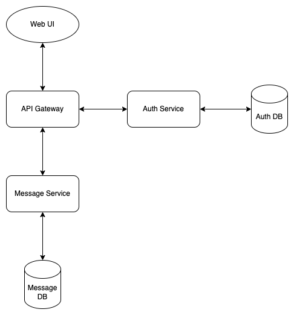

# Microservice Auth Demo

[](https://github.com/matthew-vance/microservice-auth-demo/actions/workflows/main.yml)

### Install

```bash
npm ci
```

### Start all services

```bash
npm run dev
```

### Build all services

```bash
npm run build
```

Data is seeded with two accounts, each with one message.

Go to http://localhost:3000 and log in with either account.

```
email: a@a.com
password: tothemoon
```

```
email: b@a.com
password: tothemoon
```

The logged in account's message should display once authenticated.

## Diagram


